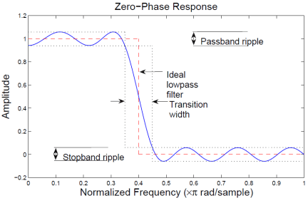
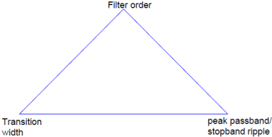

Based on this excellent Matlab tutorial. on the subject

The ideal lowpass filter is one that leaves unchanged all frequency components of a signal below a designated cutoff frequency, ωc , and rejects all components above ωc . Because the impulse response required to implement the ideal lowpass filter is infinitely long, it is impossible to design an ideal FIR lowpass filter. Finite length approximations to the ideal impulse response lead to the presence of ripples in both the passband (ω<ωc) and the stopband (ω>ωc) of the filter, as well as to a nonzero transition width between passband and stopband.

Both the passband/stopband ripples and the transition width are undesirable but unavoidable deviations from the response of an ideal lowpass filter when approximated with a finite impulse response. These deviations are depicted in the following figure:



Practical FIR designs typically consist of filters that have a transition width and maximum passband and stopband ripples that do not exceed allowable values. In addition to those design specifications, one must select the filter order,or, equivalently, the length of the truncated impulse response.

A useful metaphor for the design specifications in filter design is to think of each specification as one of the angles in the triangle shown in the figure below.




The triangle is used to understand the degrees of freedom available when choosing design specifications. Because the sum of the angles is fixed, one can at most select the values of two of the specifications. The third specification will be determined by the particular design algorithm. Moreover, as with the angles in a triangle, if we make one of the specifications larger/smaller, it will impact one or both of the other specifications.

FIR filters are very attractive because they are inherently stable and can be designed to have linear phase. Nonetheless, these filters can have long transient responses and might prove computationally expensive in certain applications.

```python
import numpy as np
from matplotlib import pyplot as plt
from scipy.signal import *
```

Minimum-Order FIR Designs

Minimum-order designs are obtained by specifying passband and stopband frequencies as well as a passband ripple and a stopband attenuation. The design algorithm then chooses the minimum filter length that complies with the specifications.

Design a minimum-order lowpass FIR filter with a passband frequency of 0.37pi rad/sample, a stopband frequency of 0.43pi rad/sample (hence the transition width equals 0.06*pi rad/sample), a passband ripple of 1 dB and a stopband attenuation of 30 dB.

See the filtering functionalities available here: https://docs.scipy.org/doc/scipy/reference/signal.html

```python
fpass = 370 
fstop = 430
ap = 1
astop = 30
fs = 2000 

filtord = np.ceil(fs/(fstop-fpass) * (astop/22)).astype(np.int32)
# https://dsp.stackexchange.com/questions/37646/filter-order-rule-of-thumb?newreg=141e955c67704f9d8b5df855233101c1
```

Blog posts support [Docusaurus Markdown features](https://docusaurus.io/docs/markdown-features), such as [MDX](https://mdxjs.com/).

:::tip

Use the power of React to create interactive blog posts.

```python
import numpy as np
from matplotlib import pyplot as plt
from scipy.signal import *
```


:::
